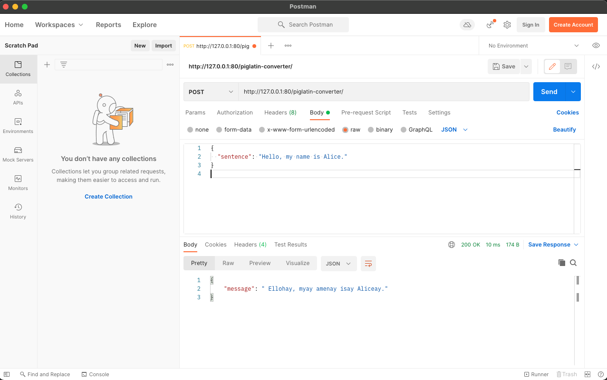

# Pig Latin Converter 
A tool that takes in a word (or a sentence) and converts it to pig latin.

# Tools and Technologies Used

- Docker (Single Dockerfile)
- Pycharm (Basic debugging for logical flows and edge cases)
- Iterm2 (Bash Terminal UI)
- FastAPI (Includes Uvicorn and Pydantic for Request Body)

**NOTE** : It was assumed that consonant clusters could not exceed lengths of 3. If wikipedia says so, it must be true. https://en.wikipedia.org/wiki/Consonant_cluster


### The rules for pig latin are as follows:

1. For words that begin with a consonant, all letters before the initial vowel are placed at the end of the word sequence. Then, "ay" is added.

* pig => igpay
* latin => atinlay
* banana => ananabay

2. When words begin with consonant clusters (multiple consonants that form one sound), the whole sound is added to the end when speaking or writing.

* smile => ilesmay
* string => ingstray
* glove => oveglay

3. For words that begin with vowels, one just adds "ay" to the end. Examples are:

* eat => eatay
* omelet => omeletay
* are => areay

These rules are a simplified version of the ones from Wikipedia. https://en.wikipedia.org/wiki/Pig_Latin


# Running The App
I setup a fresh install of python3 using Homebrew. For more information on Homebrew: https://brew.sh

Assuming you have a installation of python locally, which can be verified with: 

`python --version` or `python3 --version`. (On Mac, you'll have both out of the box)

Once you have Python installed, go ahead and clone this repository.


# Running through Docker

Then from the project directory you just cloned the project into, run: 

`docker build -t piglatin .`

You should see something like : 

````[+] Building 0.9s (10/10) FINISHED
 => [internal] load build definition from Dockerfile                                                                                                                                                   0.0s
 => => transferring dockerfile: 284B                                                                                                                                                                   0.0s
 => [internal] load .dockerignore                                                                                                                                                                      0.0s
 => => transferring context: 2B                                                                                                                                                                        0.0s
 => [internal] load metadata for docker.io/library/python:3.9                                                                                                                                          0.8s
 => [1/5] FROM docker.io/library/python:3.9@sha256:4c41af7a9e87a725aa0dd3857ceb51d0deea8923ceb362aa38eaa5e525a23a21                                                                                    0.0s
 => [internal] load build context                                                                                                                                                                      0.0s
 => => transferring context: 2.33kB                                                                                                                                                                    0.0s
 => CACHED [2/5] WORKDIR /code                                                                                                                                                                         0.0s
 => CACHED [3/5] COPY ./requirements.txt /code/requirements.txt                                                                                                                                        0.0s
 => CACHED [4/5] RUN pip install --no-cache-dir --upgrade -r /code/requirements.txt                                                                                                                    0.0s
 => [5/5] COPY ./main.py /code/                                                                                                                                                                        0.0s
 => exporting to image                                                                                                                                                                                 0.0s
 => => exporting layers                                                                                                                                                                                0.0s
 => => writing image sha256:9ceb71f1adf4eece7c27676483c81d559a963b449e583e49862142db5b32bcb0                                                                                                           0.0s
 => => naming to docker.io/library/piglatin
````

To run the image you just composed and create the container, run:

`docker run -d --name piglatin -p 80:80 piglatin`


Then, if you hit `http://localhost:80/piglatin-converter` with a string as a json request body, you'll get your responses.

Here's an example in Postman : https://www.postman.com/downloads/

